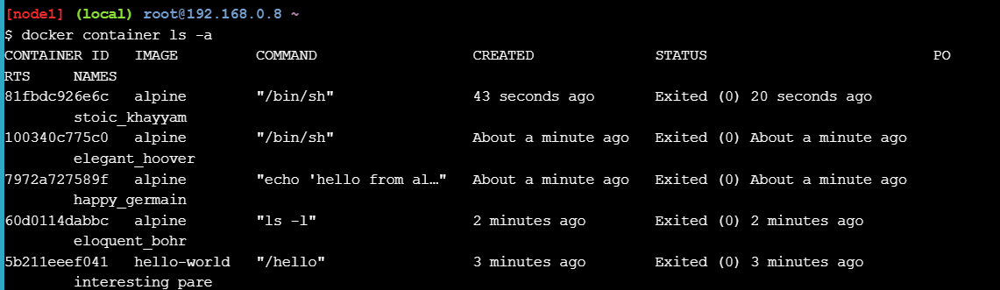
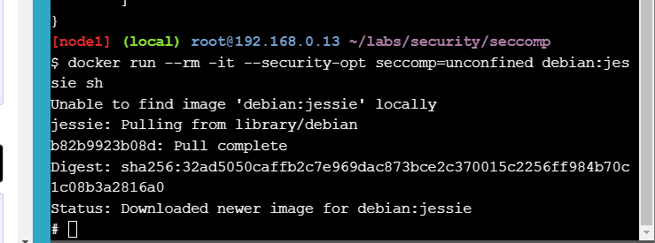
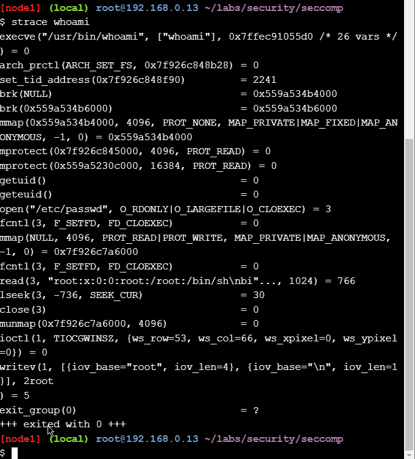
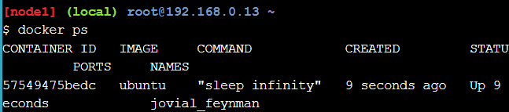
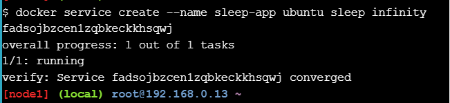
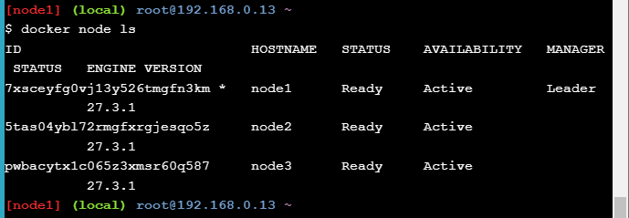
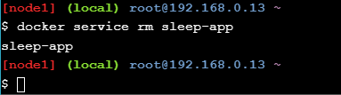
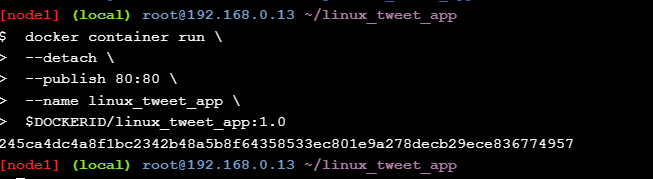
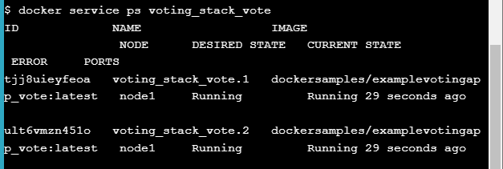

# Getting Started Walk-through for IT Pros and System Administrators

# Stage 1: The Basics
## First Alpine Linux Containers

### 1.0 Running your first container

```bash
docker container run hello-world
```


### 1.1 Docker Images

```bash
docker image pull alpine
```


```bash
docker image ls
```


### 1.1 Docker Container Run

```bash
docker container run alpine ls -l
```


```bash
docker container run alpine echo "hello from alpine"
```


```bash
docker container run alpine /bin/sh
```


```bash
docker container run -it alpine /bin/sh
```


```bash
docker container ls
```


```bash
docker container ls -a
```



### 1.2 Container Isolation

```bash
docker container run -it alpine /bin/ash
```


```bash
docker container run alpine ls
```


```bash
docker container ls -a
```


```bash
docker container start 81f
docker container start 684
```

```bash
docker container ls
```


```bash
docker container exec 81f ls
```

```bash
docker container exec 684 ls
```


## Doing More With Docker Images

### 1.0 Image creation from a container

```bash
docker container run -ti ubuntu bash

apt-get update
apt-get install -y figlet
figlet "hello docker"
```


```bash
docker container ls -a
```


```bash
docker container commit CONTAINER_ID
docker image ls
```


```bash

docker image tag 3c580260bacf ourfiglet
docker image ls
```


```bash
docker container run ourfiglet figlet hello
```


### 2.0 Image creation using a Dockerfile

```bash
docker image build -t hello:v0.1 .
```


```bash
docker container run hello:v0.1
```


### 3.0 Image layers

```bash
docker image ls
docker image history 2b
```


```bash
echo "console.log(\"this is v0.2\");" >> index.js
docker image build -t hello:v0.2 .
```


### 4.0 Image Inspection

```bash
docker image pull alpine
docker image inspect alpine
```


```bash
docker image inspect --format "{{ json .RootFS.Layers }}" alpine
```


```bash
docker image inspect --format "{{ json .RootFS.Layers }}" 97044ff13e5a
```


## Swarm Mode Introduction for IT Pros

### 1.0 Initialize Your Swarm

```bash
docker swarm init --advertise-addr $(hostname -i)
```


```bash 
docker swarm join --token SWMTKN-1-5bmrgxt0uwb1hsbs661io0ho2s91lfnv3w513wgq2n6ia10liw-cggqjsbiw7buyg2uxfyplvvfq 192.168.0.17:2377
```


### 2.0 Show Swarm Members

```bash
docker node ls
```


### 3.0 Clone the Voting App
```bash
git clone https://github.com/docker/example-voting-app
cd example-voting-app
```


### 4.0 Deploy a Stack

```bash
cat docker-stack.yml
```


```bash
docker stack deploy --compose-file=docker-stack.yml voting_stack
```


```bash
docker stack ls
```


```bash
docker stack services voting_stack
```


```bash
docker service ps voting_stack_vote
```


### 5.0 Scaling An Application

```bash
docker service scale voting_stack_vote=5
```


# Stage 2: Digging Deeper

## Seccomp profiles Security Lab: Seccomp

### Step 1: Clone the labs GitHub repo

```bash
git clone https://github.com/docker/labs
cd labs/security/seccomp
```


### Step 2: Test a seccomp profile

```bash
docker run --rm -it --cap-add ALL --security-opt apparmor=unconfined --security-opt seccomp=seccomp-profiles/deny.json alpine sh```


```bash
cat seccomp-profiles/deny.json
```


### Step 3: Run a container with no seccomp profile

```bash
docker run --rm -it --security-opt seccomp=unconfined debian:jessie sh
```



```bash 
whoami

unshare --map-root-user --user
whoami

exit
exit
```


```bash
apk add --update strace
strace -c -f -S name whoami 2>&1 1>/dev/null | tail -n +3 | head -n -2 | awk '{print $(NF)}'
```


```bash
strace whoami
```


### Step 4: Selectively remove syscalls

```bash
docker run --rm -it --security-opt seccomp=./seccomp-profiles/default-no-chmod.json alpine sh
```

```bash
chmod 777 / -v
```


```bash
docker run --rm -it --security-opt seccomp=./seccomp-profiles/default.json alpine sh
```

```bash
chmod 777 / -v
```


```bash
exit

cat ./seccomp-profiles/default.json | grep chmod

cat ./seccomp-profiles/default-no-chmod.json | grep chmod
```


### Step 5: Write a seccomp profile

```bash
strace -c -f -S name ls 2>&1 1>/dev/null | tail -n +3 | head -n -2 | awk '{print $(NF)}'
```


### Step 6: A few gotchas


## Linux Kernel Capabilities and Docker Security Lab: Capabilities

### Step 1: Introduction to capabilities


### Step 2: Working with Docker and capabilities


### Step 3: Testing Docker capabilities

```bash
docker run --rm -it alpine chown nobody /
```


```bash
docker run --rm -it --cap-drop ALL --cap-add CHOWN alpine chown nobody /
```


```bash
docker run --rm -it --cap-drop CHOWN alpine chown nobody /
```


```bash
docker run --rm -it --cap-add chown -u nobody alpine chown nobody /
```


### Step 4: Extra for experts

```bash
docker run --rm -it alpine sh -c 'apk add -U libcap; capsh --print'
```


```bash
docker run --rm -it alpine sh -c 'apk add -U libcap;capsh --help'
```


## Docker Networking Hands-on Lab
### Section #1 - Networking Basics
### Step 1: The Docker Network Command

```bash
docker network
```


### Step 2: List networks
```bash
docker network ls
```


### Step 3: Inspect a network

```bash
docker network inspect bridge
```


### Step 4: List network driver plugins

```bash
docker info
```


### Section #2 - Bridge Networking
### Step 1: The Basics

```bash
docker network ls
```


```bash
apk update
apk add bridge
```


```bash
brctl show
```


```bash
ip a
```


### Step 2: Connect a container

```bash
docker run -dt ubuntu sleep infinity
```


```bash
docker ps
```


```bash
brctl show
```


```bash
docker network inspect bridge
```


### Step 3: Test network connectivity

```bash
docker ps
```


```bash
docker exec -it 9b /bin/bash
apt-get update && apt-get install -y iputils-ping
ping -c5 www.github.com
```


### Step 4: Configure NAT for external connectivity

```bash
docker run --name web1 -d -p 8080:80 nginx
```


```bash
docker ps
```


```bash
curl 127.0.0.1:8080
```


### Section #3 - Overlay Networking
### Step 1: The Basics

```bash
docker swarm init --advertise-addr $(hostname -i)
```


```bash
docker swarm join --token SWMTKN-1-05pqqmsx3frv1ar23ui9o2ndqwfhlhe5vp2kmr9h5dmg2j9chh-4qu1my5cm981etzukcbq1e3ur 192.168.0.18:2377
```


```bash
docker node ls
```


### Step 2: Create an overlay network

```bash
docker network create -d overlay overnet
```


```bash
docker network ls
```


```bash
docker network ls
```


```bash
docker network inspect overnet
```


### Step 3: Create a service

```bash
docker service create --name myservice \
--network overnet \
--replicas 2 \
ubuntu sleep infinity
```


```bash
docker service ls
```


```bash
docker service ps myservice
```


```bash
docker network ls
```


```bash
docker network inspect overnet
```


### Step 4: Test the network

```bash
docker network inspect overnet
```


```bash
docker ps
```


```bash
docker exec -it b388 /bin/bash
```


```bash
ping -c5 10.0.0.3
```


### Step 5: Test service discovery

```bash
cat /etc/resolv.conf
```


```bash
docker service inspect myservice
```


### Cleaning Up

```bash
docker service rm myservice
```


```bash
docker ps
```


```bash
docker swarm leave --force
```


```bash
docker swarm leave --force
```


## Docker Orchestration Hands-on Lab

### Section 1: What is Orchestration

### Section 2: Configure Swarm Mode

```bash
docker run -dt ubuntu sleep infinity
```


```bash
docker ps
```



### Step 2.1 - Create a Manager node

```bash
docker swarm init --advertise-addr $(hostname -i)
```


```bash
docker info
```


### Step 2.2 - Join Worker nodes to the Swarm

```bash
docker swarm join --token SWMTKN-1-5h68elcxitpddq3gmxhyc34gcb4v72mc7evuwksyul6346fj7m-357o1rhdv3wesufdvc6jmm37f 192.168.0.13:2377
```


```bash
docker node ls
```


### Section 3: Deploy applications across multiple hosts

### Step 3.1 - Deploy the application components as Docker service

```bash
docker service create --name sleep-app ubuntu sleep infinity
```



```bash
docker service ls
```


### Section 4: Scale the application

```bash
docker service update --replicas 7 sleep-app
```


```bash
docker service ps sleep-app
```


```bash
docker service update --replicas 4 sleep-app
```


```bash
docker service ps sleep-app
```


### Section 5: Drain a node and reschedule the containers

```bash
docker node ls
```


```bash
docker ps
```


```bash
docker node ls
```


```bash

docker node update --availability drain 5tas04ybl72rmgfxrgjesqo5z

docker node ls
```


```bash
docker ps
```


```bash
docker service ps sleep-app
```


### Cleaning Up

```bash
docker service rm sleep-app
```


```bash
docker ps
```


```bash
docker kill 57549475bedc
```


```bash
docker swarm leave --force
docker swarm leave --force
docker swarm leave --force
```


# Getting Started Walk-through for Developers

## Stage 1: The Basics
## Docker for Beginners - Linux
### Task 0: Prerequisites

```bash
git clone https://github.com/dockersamples/linux_tweet_app
```


### Task 1: Run some simple Docker containers
```bash
docker container run alpine hostname
```


```e52dd2ebd9aa```
```bash
docker container ls --all
```


#### Run an interactive Ubuntu container

```bash
docker container run --interactive --tty --rm ubuntu bash
```


```bash
ls /
ps aux
cat /etc/issue
```


```bash
exit

cat /etc/issue
```


#### Run a background MySQL container

```bash
docker container run \
 --detach \
 --name mydb \
 -e MYSQL_ROOT_PASSWORD=my-secret-pw \
 mysql:latest
```


```bash
docker container ls
```


```bash
docker container logs mydb
```


```bash
docker container top mydb
```


```bash
docker exec -it mydb \
 mysql --user=root --password=$MYSQL_ROOT_PASSWORD --version
```


```bash
docker exec -it mydb sh
```


```bash
mysql --user=root --password=$MYSQL_ROOT_PASSWORD --version
```


### Task 2: Package and run a custom app using Docker

#### Build a simple website image

```bash
cd ~/linux_tweet_app
cat Dockerfile
```


```bash
export DOCKERID=rancerenly
echo $DOCKERID

docker image build --tag $DOCKERID/linux_tweet_app:1.0 .
```


```bash
docker container run \
 --detach \
 --publish 80:80 \
 --name linux_tweet_app \
 $DOCKERID/linux_tweet_app:1.0
```

 

```bash
docker container rm --force linux_tweet_app
```


### Task 3: Modify a running website

```bash
docker container run \
 --detach \
 --publish 80:80 \
 --name linux_tweet_app \
 --mount type=bind,source="$(pwd)",target=/usr/share/nginx/html \
 $DOCKERID/linux_tweet_app:1.0
 ```

 


```bash
cp index-new.html index.html


docker rm --force linux_tweet_app

 docker container run \
 --detach \
 --publish 80:80 \
 --name linux_tweet_app \
 $DOCKERID/linux_tweet_app:1.0

 docker rm --force linux_tweet_app
```


#### Update the image

```bash
docker image build --tag $DOCKERID/linux_tweet_app:2.0 .

docker image ls
```


#### Test the new version

```bash
 docker container run \
 --detach \
 --publish 80:80 \
 --name linux_tweet_app \
 $DOCKERID/linux_tweet_app:2.0
 ```
 
```bash
docker container run \
 --detach \
 --publish 8080:80 \
 --name old_linux_tweet_app \
 $DOCKERID/linux_tweet_app:1.0
 ```


#### Push your images to Docker Hub

```bash

docker image ls -f reference="$DOCKERID/*"
docker login

*** 

docker image push $DOCKERID/linux_tweet_app:1.0
docker image push $DOCKERID/linux_tweet_app:2.0
```


## Application Containerization and Microservice Orchestration

### Stage Setup


### Step 0: Basic Link Extractor Script

```bash
git checkout step0
tree

cat linkextractor.py

./linkextractor.py http://example.com/

ls -l linkextractor.py

python3 linkextractor.py
```


### Step 1: Containerized Link Extractor Script


```bash
git checkout step1
tree

cat Dockerfile

docker image build -t linkextractor:step1 .
```


```bash
docker image ls
```


```bash
docker container run -it --rm linkextractor:step1 http://example.com/
```
Вывод:
```bash
http://www.iana.org/domains/example
```

### Step 2: Link Extractor Module with Full URI and Anchor Text


```bash
git checkout step2
tree

cat linkextractor.py

docker image build -t linkextractor:step2 .

docker image ls
```


```bash
docker container run -it --rm linkextractor:step2 http://example.com/
```

Вывод:

```bash
[More information...](http://www.iana.org/domains/example)
```

### Step 3: Link Extractor API Service

```bash

git checkout step3
tree

cat Dockerfile

cat main.py

docker image build -t linkextractor:step3 .

docker container run -d -p 5000:5000 --name=linkextractor linkextractor:step3

```


```bash
curl -i http://localhost:5000/api/http://example.com/
```

```bash
HTTP/1.0 200 OK
Content-Type: application/json
...
[{"href":"http://www.iana.org/domains/example","text":"More information..."}]
```

### Step 4: Link Extractor API and Web Front End Services

```bash

git checkout step4
tree

cat docker-compose.yml

cat www/index.php

docker-compose up -d --build
```


```bash
docker container ls
```


```bash
curl -i http://localhost:5000/api/http://example.com/
-----

-----
HTTP/1.0 200 OK
Content-Type: application/json
...

```

### Step 5: Redis Service for Caching

```bash

git checkout step5
tree

cat www/Dockerfile

cat api/main.py

cat docker-compose.yml

docker-compose up -d --build
```


### Step 6: Swap Python API Service with Ruby

```bash

git checkout step6
tree

cat api/linkextractor.rb

cat api/Dockerfile

cat docker-compose.yml

docker-compose up -d --build
```


```bash
curl -i http://localhost:4567/api/http://example.com/

HTTP/1.1 200 OK
Content-Type: application/json
...
Connection: Keep-Alive

[
  {
    "text": "More information...",
    "href": "http://www.iana.org/domains/example"
  }
]

```

## Deploying a Multi-Service App in Docker Swarm Mode Swarm stack introduction


### Init your swarm

```bash
docker swarm init --advertise-addr $(hostname -i)
```


### Show members of swarm
```bash
docker node ls
```


### Clone the voting-app

```bash
git clone https://github.com/docker/example-voting-app
cd example-voting-app
```


### Deploy a stack

```bash
docker stack deploy --compose-file=docker-stack.yml voting_stack

docker stack ls
```


```bash
docker stack services voting_stack
```


```bash
docker service ps voting_stack_vote
```
